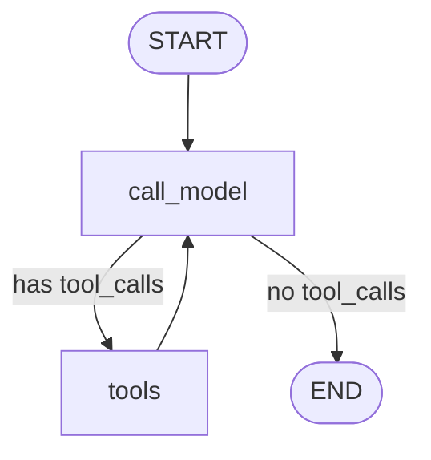

# conversation_agent.py — Persistent Conversation with LangGraph Checkpointing

## File Comparison

| Feature | `manual-tool-handling.py` | `langgraph-tool-handling.py` | `conversation_agent.py` |
|---|---|---|---|
| Tool loop | Python `for i in range(5)` | LangGraph edges | LangGraph edges |
| Multi-turn memory | None (resets per call) | In-graph state (resets on re-run) | `MemorySaver` checkpoint |
| Context across turns | No | No | Yes — `add_messages` reducer |
| Resume session | No | No | Yes — `thread_id` arg |
| Input handling | Passed as arg | `input_node` inside graph | Python `while` loop outside graph |
| Checkpoint inspection | No | No | `show_checkpoint()` + `history` cmd |
| Nodes | N/A | 5 (input, call_model, tools, output, trim) | 2 (call_model, ToolNode) |

---

## Graph Structure



---

## Annotated Conversation Example

```
── Thread: a3f2b1c9 ──
Commands: 'exit' to quit, 'history' to show checkpoint.

You: What's the weather in London?
```
> Turn 1 — `call_model` receives `[SystemMessage, HumanMessage]`.
> Model calls `get_weather("London")`.
> Graph routes to `tools`, executes tool, routes back to `call_model`.
> Model sees `ToolMessage("Rainy, 48°F")`, generates final answer.

```
Assistant: The current weather in London is rainy with a temperature of 48°F.

You: How many o's are in London?
```
> Turn 2 — checkpoint loads prior 4 messages; `call_model` now sees 5 messages
> (System + Human + AI + Tool + AI). Model calls `count_letter("London", "o")`.
> Routes through `tools` → `call_model` → END.

```
Assistant: There are 2 o's in "London".

You: Convert that temperature to Celsius.
```
> Turn 3 — "that temperature" refers to 48°F from the earlier weather reply.
> The full message history in the checkpoint gives the model context.
> `call_model` calls `unit_converter(48, "fahrenheit", "celsius")`.

```
Assistant: 48°F is approximately 8.89°C.

You: history
```
> `history` command calls `show_checkpoint()` — no graph invocation.

```
── Checkpoint 'a3f2b1c9' (10 messages) ──
  [System    ] You are a helpful assistant. Use the provided tools when needed.
  [Human     ] What's the weather in London?
  [AI        ] [tool calls pending]
  [Tool      ] Rainy, 48°F
  [AI        ] The current weather in London is rainy with a temperature of 48°F.
  [Human     ] How many o's are in London?
  [AI        ] [tool calls pending]
  [Tool      ] {"text": "London", "letter": "o", "count": 2}
  [AI        ] There are 2 o's in "London".
  [Human     ] Convert that temperature to Celsius.
```
> (The 10th message — the AI reply with Celsius — appears after this invoke completes.)

```
You: What is the area of a circle with radius equal to the o count?
```
> Turn 4 — multi-step chain: model knows the o count is 2 from history,
> calls `calculator(mode="geometry", shape="circle", operation="area", dimensions='{"radius": 2}')`.

```
Assistant: A circle with radius 2 has an area of approximately 12.566 square units (π × 2²).
```

---

## Recovery Walkthrough

### Mid-session inspection

```
You: history

── Checkpoint 'a3f2b1c9' (10 messages) ──
  [System    ] You are a helpful assistant...
  [Human     ] What's the weather in London?
  ...
```

### Graceful Ctrl+C

```
You: ^C
[Interrupted. Resume: python conversation_agent.py a3f2b1c9]
```

The `thread_id` is printed so you can copy it directly.

### Resuming a thread

```bash
python conversation_agent.py a3f2b1c9
```

Or as an option gives threads and previous conversations which can be chosen with either the corresponding number or its thread ID: 

── Previous conversations ──
  [1] 2c46c8df  2026-02-27T20:55:08  Count the 'e's in 'Tennessee'. Convert that many degrees Fah

Enter number to resume, thread ID directly, or press Enter for new: 

Output:
```
Resuming thread 'a3f2b1c9'...

── Checkpoint 'a3f2b1c9' (10 messages) ──
  [System    ] You are a helpful assistant...
  [Human     ] What's the weather in London?
  ...

── Thread: a3f2b1c9 ──
Commands: 'exit' to quit, 'history' to show checkpoint.

You:
```

For persistence across restarts, uses `SqliteSaver`:

```python
from langgraph.checkpoint.sqlite import SqliteSaver

checkpointer = SqliteSaver.from_conn_string("conversations.db")
graph = workflow.compile(checkpointer=checkpointer)
```


